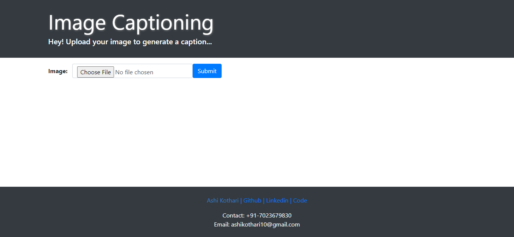
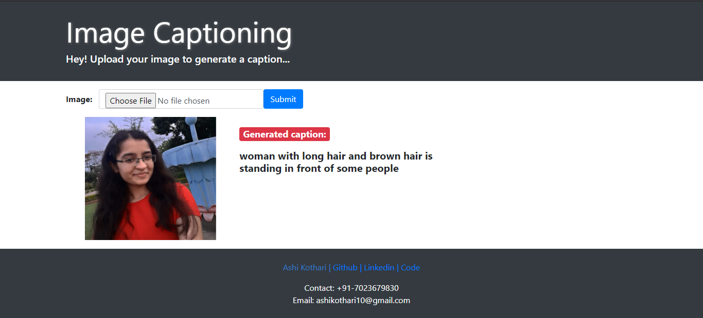

# Image Captioning
Generating Captions for Images using ML, Computer Vision and Deep learning algorithms.

<h2>What is Image Captioning?</h2>
Image Captioning is the process of generating textual description of an image. It uses both Natural Language Processing and Computer Vision to generate the captions. Interface is made as: 

   

### Dependencies
You need to have python and jupyter notebook installed in your systems. The system can also be deployed on the server. I completed its backend using Flask but since it uses tensorflow in backend (large size) so it can not be deployed for free :(  
To run it as local host you can clone the repository and run <strong>python app.py</strong> on command line (in the directory where files are located). Also if some problem persists in this you can run <b> flask run --without-threads </b> i.e. with debug mode off. This error may occur due to different version of tensorflow and keras used. I used tensorflow vesion 2.1.0 and keras version 2.3.1.
Files required for hosting on heroku are int this repository https://github.com/AshiKothari/Automated-Image-Captioning

### Libraries Required
Anaconda installs all the necessary libraries I have used in this project but I still list them below.
numpy matplotlib openCV sklearn pandas

### About the Dataset
Can download the dataset from here- https://www.kaggle.com/shadabhussain/flickr8k?select=Flickr_Data
1. Flikr8k_Dataset (Contains Images)
2. Flikr8k_text (Contains Text)
Dataset contains 8000 images, of which 6000 are used for training purpose and remaining for validattion and testing.
Each image has almost 5 captions in Flickr8k.txt. This means in total there are 8000*5=40000 captions in the text file Flikr8k_token.txt

### Steps taken in the project
1.Data collection 
2.Understanding the data 
3.Data Cleaning 
4.Loading the training set 
5.Data Preprocessing — Images 
6.Data Preprocessing — Captions 
7.Data Preparation using Generator Function 
8.Word Embeddings 
9.Model Architecture 
10.Inference 

### Applications
1.Visual Aid for blind people - Can be used to convert Images to text for recognization. 
2.Google search- Given a image to search it is converted to text to search the similar results. 
3.Automatic Surveillance (CCTV cameras)- Alarm could be used for malicious activities detected. 

